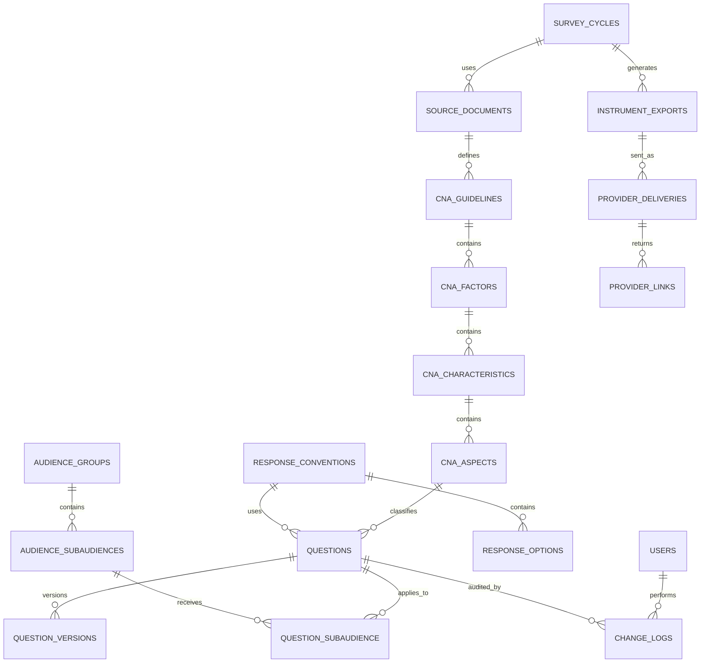

# Documento de contexto funcional, datos y propuesta de solución

## Encuesta de Autoevaluación Institucional y por Programas

**Propósito:** Consolidar el contexto actual del proceso de actualización de encuestas, los documentos usados, los requisitos de información, las entidades importantes del dominio, el encaje con el ERD propuesto y una solución basada en una aplicación local sincronizada con Microsoft que mantenga una base de datos como única fuente de verdad.

## 1. Resumen ejecutivo

El proceso actual de actualización de la encuesta depende de la comparación manual entre los lineamientos CNA en PDF y varios archivos Excel operativos. Esta dinámica permite trabajar con herramientas conocidas, pero genera tiempos largos de revisión, riesgo de omisión de preguntas, dificultad para reconstruir cambios y dependencia de pocas personas.

La solución propuesta consiste en implementar una aplicación local que administre una base de datos SQLite/libSQL como fuente única de verdad. La aplicación generaría los Excel requeridos cuando sean necesarios, conservaría trazabilidad por ciclo y se integraría con el entorno Microsoft institucional para sincronización, respaldo y distribución controlada de archivos.

## 2. Fuentes revisadas

- **Transcripción de reunión** (`Pasted text.txt`): Contexto operativo: propósito de la encuesta, públicos, periodicidad, proceso manual, uso de OneDrive, expectativas y trazabilidad con proveedor.
- **Lineamiento CNA - Programas** (`Programas_Aspectos_a_Evalua_octubre_2022 (preguntas).pdf`): Fuente normativa para autoevaluación de programas académicos. Contiene factores, características y aspectos por evaluar.
- **Lineamiento CNA - Instituciones** (`IES Aspectos a_Evaluar_en_acreditacion_octubre_2022 (preguntas).pdf`): Fuente normativa para autoevaluación institucional. Contiene factores, características y aspectos por evaluar.
- **Instrumento final estudiantes** (`Instrumento final estudiantes.xlsx`): Instrumento operativo para el público estudiantes, con vista por lineamiento, vista por orden y convención de respuesta.
- **Instrumento final profesores planta** (`Instrumento final profesores planta VF.xlsx`): Instrumento operativo para profesores de planta, con vista por lineamiento, vista por orden y convención de respuesta.
- **Consolidado de preguntas** (`Consolidado de preguntas Enc de Aut Ins y Pr 2024 1.xlsx`): Banco operativo consolidado. Incluye factor, característica, aspecto, tipo de pregunta, estado, convención, pregunta, público, tipo de público y observaciones.
- **Informe técnico del modelo actual** (`Pasted markdown (2).md`): Modelo de información, entidades propuestas, objetivo del modelado y diagrama de contexto de negocio.

## 3. Proceso actual documentado

### Preparación del ciclo de autoevaluación
- La encuesta se aplica como medición de percepción y satisfacción institucional y por programas.
- El ciclo se realiza aproximadamente cada dos años; para el nuevo ciclo se empieza a revisar desde mitad de año porque la aplicación inicia en enero.
- Se identifican los públicos objetivo: estudiantes, profesores de planta, profesores de cátedra, directivos de unidad académica, directivos de unidad central, administrativos y servicios generales.

### Revisión de lineamientos CNA
- Se toman los PDF del CNA como fuente normativa.
- Se revisan los aspectos de apreciación/percepción definidos por el CNA.
- Cada aspecto de apreciación genera una o varias preguntas dentro del instrumento.
- La revisión distingue entre lineamientos institucionales y lineamientos de programas académicos.

### Comparación contra el banco de preguntas actual
- Las responsables comparan manualmente el PDF del CNA contra el Excel existente.
- La comparación se realiza pregunta por pregunta y aspecto por aspecto.
- Se verifica que ningún aspecto quede sin pregunta cuando debe medirse por percepción.
- El trabajo se hace en jornadas extensas porque implica revisar pantalla de PDF y pantalla de Excel de forma paralela.

### Marcación de cambios
- Se identifican preguntas nuevas, modificadas, mantenidas y eliminadas.
- Los cambios se marcan visualmente mediante colores para que el proveedor entienda qué debe ajustar en su plataforma.
- No se puede eliminar o cambiar una pregunta sin dejar rastro porque afecta la comparación entre mediciones.

### Construcción de instrumentos por público
- A partir del consolidado se estructuran instrumentos específicos por público y subpúblico.
- Los instrumentos tienen dos vistas principales: por lineamiento CNA y por orden de aparición.
- Las preguntas se distribuyen por subpúblicos como pregrado, maestrías, doctorado, especializaciones, unidades académicas, unidades centrales y servicios generales.

### Envío al proveedor externo
- El proveedor recibe normalmente el archivo Excel, aunque no hay una restricción fuerte de formato siempre que los cambios sean claros.
- El proveedor configura los enlaces de encuesta específicos para cada público.
- El proveedor necesita saber qué preguntas son nuevas, modificadas o eliminadas para actualizar su banco y su plataforma.

### Validación de enlaces y aplicación
- Después de configurar las encuestas, se revisan los enlaces generados por el proveedor.
- La validación busca asegurar que cada público reciba el instrumento correcto y que las preguntas correspondan al banco aprobado.
- Posteriormente se distribuyen los enlaces a la audiencia correspondiente.

### Reporte y comparación histórica
- El proveedor compara la medición actual con la anterior.
- Una pregunta nueva no tiene resultado en la medición anterior; una pregunta eliminada desaparece del informe actual.
- La trazabilidad de cambios es necesaria para interpretar correctamente los informes y no perder continuidad histórica.

## 4. Requisitos funcionales

- **RF-01:** Registrar lineamientos CNA por alcance y ciclo.
- **RF-02:** Mantener jerarquía Factor → Característica → Aspecto.
- **RF-03:** Administrar banco único de preguntas.
- **RF-04:** Asignar preguntas a uno o varios subpúblicos.
- **RF-05:** Administrar convenciones de respuesta.
- **RF-06:** Controlar estados: mantener, modificar, agregar, eliminar.
- **RF-07:** Versionar preguntas y conservar historial.
- **RF-08:** Generar instrumentos Excel por público, por orden y por lineamiento.
- **RF-09:** Registrar entrega al proveedor y archivos enviados.
- **RF-10:** Registrar y validar enlaces del proveedor.
- **RF-11:** Ejecutar validaciones previas a exportación.
- **RF-12:** Generar reportes de trazabilidad por ciclo.
- **RF-13:** Marcar un Excel importado como línea base original del ciclo y comparar todos los cambios posteriores contra esa fuente.
- **RF-14:** Exigir confirmación reforzada para fijar o reemplazar la línea base original, incluyendo resumen de impacto, confirmación textual y respaldo previo.
- **RF-15:** Exportar instrumentos por público y el consolidado completo en formato equivalente a los Excel actuales.
- **RF-16:** Resaltar cambios en exportaciones: preguntas eliminadas en rojo, modificadas en azul y agregadas en verde.
- **RF-17:** Evitar duplicados de preguntas y lineamientos al importar, usando identidad estable por código de pregunta y por jerarquía CNA.
- **RF-18:** Generar automáticamente la clave interna del aspecto en altas manuales; el usuario no debe digitar `N° Aspecto`.
- **RF-19:** Permitir factores y características adicionales de forma guiada; los factores CNA conocidos son presets, no una lista cerrada.
- **RF-20:** Revisar preguntas por lineamiento y abrir rápidamente el banco filtrado por ese aspecto.
- **RF-21:** Ejecutar revisión del proveedor por pregunta, marcando correcta, requiere modificación o no aparece, con observación y evidencia opcional.
- **RF-22:** Generar un documento Word de revisión del proveedor con estado, observaciones y evidencia registrada por pregunta.
- **RF-23:** Configurar instrumentos como entidades editables y asignar públicos/subpúblicos detectados desde el consolidado.
- **RF-24:** Ejecutar revisión del proveedor por instrumento exportado, no por público suelto.
- **RF-25:** Exportar el documento Word de revisión del proveedor únicamente para el instrumento seleccionado.
- **RF-26:** Permitir pegar imágenes como evidencia y adjuntarlas automáticamente a la revisión de proveedor.
- **RF-27:** Usar Turso Cloud como modo colaborativo recomendado, con estado visible de conexión y editores activos.
- **RF-28:** Adquirir bloqueos de edición al intentar editar preguntas, lineamientos o instrumentos, mostrando el responsable si otro editor tiene el lock.
- **RF-29:** Evitar lecturas innecesarias de locks; solo consultar locks conocidos o el recurso que el usuario intenta editar.
- **RF-30:** Bloquear guardados si otro editor cambió la pregunta desde que el usuario la cargó.
- **RF-31:** Antes de mostrar importación inicial, validar si Turso ya contiene datos y cargarlos como fuente colaborativa.
- **RF-32:** Si la base ya contiene datos, exigir confirmación reforzada antes de importar otro consolidado.
- **RF-33:** Exportar y abrir paquetes `.acna` con la base completa, historial, línea base y revisión de proveedor.
- **RF-34:** Mantener snapshots manuales persistentes hasta borrado explícito por el usuario.
- **RF-35:** Separar la aplicación por capas y módulos documentados para mantener importación, exportación, colaboración, proveedor, historial y persistencia evolucionables.

## 5. Documentos y artefactos

### PDF CNA - Instituciones
- **Contenido:** Factores, características y aspectos por evaluar para autoevaluación institucional. Incluye generalidades, marco conceptual y estructura oficial.
- **Uso:** Fuente normativa para determinar qué aspectos de percepción deben estar cubiertos en la encuesta institucional.
- **Destino:** Se consulta internamente por Desarrollo Estratégico. No se envía como instrumento al proveedor, pero justifica la estructura del banco.

### PDF CNA - Programas
- **Contenido:** Factores, características y aspectos por evaluar para programas académicos. Contiene lineamientos aplicables por modalidad, nivel y lugar de desarrollo.
- **Uso:** Fuente normativa para mapear preguntas de programas académicos y validar cobertura de aspectos por evaluar.
- **Destino:** Se consulta internamente. Sirve para justificar cambios y para revisar coherencia con la acreditación de programas.

### Consolidado de preguntas
- **Contenido:** Banco operativo con columnas de factor, característica, aspecto, tipo de pregunta, estado, convención, número de pregunta, texto, público, tipo de público y observaciones.
- **Uso:** Funciona como base manual de control de preguntas y distribución por audiencia. Permite identificar mantener, modificar, agregar o eliminar.
- **Destino:** Se usa internamente y puede alimentar archivos de trabajo para el proveedor.

### Instrumentos finales por público
- **Contenido:** Hojas por lineamiento y por orden; columnas por subpúblico; convención de respuesta; texto de pregunta adaptado según audiencia.
- **Uso:** Representan el instrumento listo para revisión y configuración por público.
- **Destino:** Se envían o se pueden enviar al proveedor para crear enlaces de encuesta.

### Hoja de convención
- **Contenido:** Equivalencias de calificación y opciones A, B, C, D, E, F, G, H, I, J, K, además de opción abierta cuando aplica.
- **Uso:** Estandariza escalas de respuesta y evita inconsistencias entre preguntas.
- **Destino:** Debe mantenerse alineada con lo configurado por el proveedor.

### Enlaces del proveedor
- **Contenido:** Links de aplicación por público y subpúblico.
- **Uso:** Permiten aplicar la encuesta a cada audiencia.
- **Destino:** Se distribuyen a públicos objetivo después de la validación interna.

### Reportes de resultados
- **Contenido:** Resultados de medición actual y comparación con mediciones anteriores.
- **Uso:** Permiten análisis de satisfacción, percepción y soporte a autoevaluación.
- **Destino:** Se usan en informes internos, análisis de calidad y procesos de acreditación.

## 6. Entidades importantes

- **SurveyCycle:** Ciclo de medición/autoevaluación, por ejemplo 2024-2025 o 2026-2027. Datos: `id, nombre, fecha_inicio, fecha_aplicacion, estado, observaciones`
- **SourceDocument:** Documento fuente revisado: PDF CNA, Excel consolidado, instrumento o archivo entregado por proveedor. Datos: `id, tipo, nombre_archivo, versión, fecha, ruta_cloud, hash, ciclo_id`
- **CNAGuideline:** Metadatos del lineamiento CNA usado como referencia. Datos: `id, título, alcance, fecha_publicación, source_document_id`
- **CNAFactor:** Factor oficial dentro de un lineamiento. Datos: `id, guideline_id, código, nombre, descripción, orden`
- **CNACharacteristic:** Característica oficial asociada a un factor. Datos: `id, factor_id, código, nombre, descripción, orden`
- **CNAAspect:** Aspecto por evaluar; unidad normativa que justifica una o varias preguntas. Datos: `id, characteristic_id, código, descripción, requiere_apreciación, alcance`
- **AspectInternalKey:** Clave interna generada por la aplicación para identificar un aspecto. En Excel puede existir como `N° Aspecto`, pero en la app no debe ser un campo manual obligatorio; se deriva determinísticamente de factor, característica y descripción cuando el archivo no trae un código limpio.
- **Question:** Pregunta del banco institucional. Datos: `id, código/número, texto_actual, alcance_institucional_o_programa, formato, convención_id, estado_actual, aspecto_id`
- **QuestionOriginalSnapshot:** Copia inmutable de una pregunta cuando se fija una línea base original. Datos: `id, question_id, source_document_id, código, texto_original, alcance, convención, factor, característica, aspecto, públicos_json, hash_contenido, marcado_por, marcado_at`
- **QuestionVersion:** Versión histórica de una pregunta. Datos: `id, question_id, ciclo_id, texto, estado, justificación, cambiado_por, changed_at`
- **ChangeLog:** Registro auditable de creación, modificación, eliminación, aprobación y reversión. Datos: `id, entidad, entidad_id, acción, antes, después, usuario_id, fecha`
- **AudienceGroup:** Público general: estudiantes, profesores, directivos, administrativos, servicios generales. Datos: `id, nombre, código`
- **SubAudience:** Segmento específico del público. Datos: `id, audience_group_id, nombre, código, modalidad/nivel`
- **ResponseConvention:** Escala o convención de respuesta. Datos: `id, código, nombre, definición`
- **ResponseOption:** Opción dentro de una convención. Datos: `id, convention_id, valor, etiqueta, orden`
- **QuestionSubAudience:** Relación N:M que indica a qué subpúblico aplica una pregunta. Datos: `id, question_id, subaudience_id, orden, obligatoria, texto_override`
- **InstrumentExport:** Registro de cada Excel/archivo generado por el sistema. Datos: `id, ciclo_id, audiencia, fecha, formato, ruta, hash, generado_por`
- **ExportDiff:** Marcado de diferencia usado al generar Excel. Datos: `id, export_id, question_id, tipo_cambio, color, resumen_original_vs_actual`
- **ProviderDelivery:** Paquete enviado al proveedor. Datos: `id, ciclo_id, export_id, fecha_envío, estado, observaciones`
- **ProviderLink:** Enlace recibido del proveedor para cada público/subpúblico. Datos: `id, delivery_id, subaudience_id, url, estado_validación, fecha_validación`
- **ProviderQuestionReview:** Verificación pregunta a pregunta sobre los enlaces del proveedor. Datos: `id, question_id, estado, observación, evidencia, actualizado_at`
- **ValidationCheck:** Resultado de validaciones internas sobre cobertura, cambios, enlaces y exportaciones. Datos: `id, tipo, entidad_id, resultado, mensaje, fecha, responsable`

## 7. Encaje con ERD propuesto

- **USERS:** Sirve para registrar responsables de modificación. Recomendación: Agregar roles: administrador, revisor, aprobador, lector.
- **CNA_GUIDELINES:** Representa los PDF del CNA. Recomendación: Agregar alcance: Institucional o Programas; agregar referencia al archivo fuente y ciclo.
- **CNA_FACTORS / CNA_CHARACTERISTICS / CNA_ASPECTS:** Encajan con la estructura normativa Factor → Característica → Aspecto. Recomendación: Agregar orden, descripción completa y control de vigencia por lineamiento.
- **Código de aspecto:** En los Excel aparece como columna operativa para ordenar/controlar hojas. En la aplicación debe tratarse como clave interna generada o normalizada, no como dato conceptual que el usuario deba capturar manualmente.
- **Factores y características:** Los factores CNA conocidos deben existir como presets para reducir errores, pero no deben ser una enumeración cerrada. Las características pueden repetir códigos o nombres en factores distintos; por eso la selección debe estar acotada por factor.
- **AUDIENCE_GROUPS / AUDIENCE_SUBAUDIENCES:** Encajan con público y tipo de público del Excel. Recomendación: Normalizar códigos que hoy aparecen embebidos en nombres, por ejemplo 0Estudiantes o 00Pregrado.
- **QUESTION_TYPES:** Actualmente puede confundirse con Institucional/Programa. Recomendación: Separar alcance de pregunta (institucional/programa) de formato de pregunta (cerrada, abierta, matriz).
- **RESPONSE_CONVENTIONS / RESPONSE_OPTIONS:** Encajan con la hoja Convención. Recomendación: Agregar vigencia y validación de uso para no borrar convenciones usadas históricamente.
- **QUESTIONS:** Es la entidad central del banco. Recomendación: Cambiar flags is_new/is_changed/is_deleted por estado operativo y tabla histórica QuestionVersion/ChangeLog.
- **QUESTION_ORIGINAL_SNAPSHOTS:** Debe conservar el estado exacto importado desde el Excel marcado como original. Recomendación: bloquear reemplazo accidental con doble confirmación, hash del archivo y respaldo automático.
- **QUESTION_SUBAUDIENCE:** Encaja con la distribución por columnas de subpúblicos. Recomendación: Agregar texto_override cuando la misma pregunta cambia levemente por audiencia.
- **Instrumentos/archivos:** El modelo inicial no los modela como entidades. Recomendación: Mantenerlos como artefactos generados, pero sí registrar InstrumentExport para auditoría y trazabilidad.
- **Proveedor y enlaces:** Aparecen en el proceso pero no en el ERD inicial. Recomendación: Agregar ProviderDelivery, ProviderLink y ValidationCheck.

## 8. Propuesta de solución

- **1. Fuente de verdad local:** La aplicación usa un archivo binario de base de datos SQLite/libSQL como fuente de verdad. Ese archivo contiene preguntas, estructura CNA, públicos, convenciones, cambios, exportaciones y validaciones.
- **2. Sincronización Microsoft:** El archivo se guarda en una carpeta institucional de OneDrive o SharePoint. La aplicación controla cuándo se abre, cuándo se cierra, cuándo se sube una copia y cuándo se genera una copia de seguridad versionada.
- **3. Trabajo guiado:** En lugar de editar directamente celdas de Excel, el usuario realiza acciones guiadas: importar lineamiento, crear pregunta, modificar, marcar como eliminar, asignar subpúblicos, aprobar cambios y exportar.
- **4. Generación de Excel:** Los Excel dejan de ser la fuente principal y pasan a ser salidas generadas desde la base de datos. Se pueden generar vistas por lineamiento, por orden, por público, por proveedor y por cambios.
- **5. Trazabilidad obligatoria:** Toda modificación queda asociada a usuario, fecha, ciclo, estado anterior, estado nuevo y justificación. Esto evita perder la historia de preguntas y facilita explicar diferencias entre mediciones.
- **6. Validaciones automáticas:** Antes de exportar, el sistema valida cobertura CNA, preguntas sin audiencia, preguntas sin convención, cambios sin aprobación, eliminaciones sin justificación y enlaces de proveedor pendientes de revisión.
- **7. Línea base original:** El consolidado importado puede fijarse como original del ciclo. Desde ese momento la app compara cada pregunta contra esa línea base para detectar agregado, modificado, eliminado o sin cambio.
- **8. Protección contra misclicks:** Fijar o reemplazar la línea base original requiere varias verificaciones: mostrar archivo, conteos, hash, advertencia de impacto, confirmación textual y respaldo automático antes de aplicar.
- **9. Exportación con diferencias:** Al exportar instrumentos o consolidado, la app conserva el formato de los Excel de muestra y colorea preguntas eliminadas en rojo, modificadas en azul y agregadas en verde.
- **10. Seguridad y respaldo:** El sistema mantiene backups versionados, hash del archivo y control de concurrencia para evitar conflictos cuando varias personas trabajen en la misma base.

## 9. Arquitectura de alto nivel

- Aplicación local de escritorio o aplicación local web empaquetada.
- Base de datos SQLite/libSQL como archivo binario principal.
- Carpeta institucional en OneDrive/SharePoint para sincronización y respaldo.
- Generador de Excel para instrumentos y entregas al proveedor.
- Módulo de auditoría con historial de cambios.
- Módulo de validación antes de aprobar o exportar.

> Advertencia técnica: un archivo SQLite sincronizado en OneDrive puede funcionar como respaldo y fuente controlada si hay un solo editor activo o si la aplicación implementa bloqueo. No es recomendable permitir edición simultánea directa del mismo archivo sin control.

## 10. Diagrama lógico Mermaid

